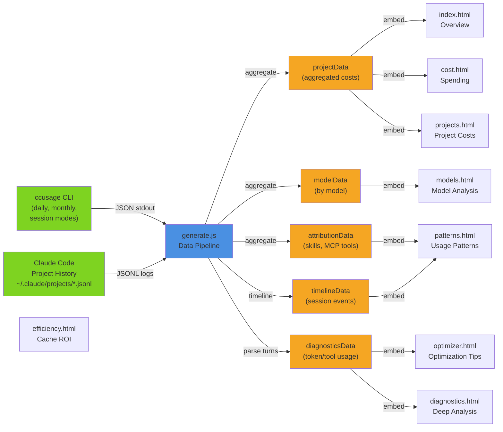

# Architecture: ccusage-report

## What This Is

**ccusage-report** is a zero-dependency, zero-build HTML dashboard that visualizes Claude Code spending, usage patterns, and performance metrics. It's a static analysis tool that transforms ccusage CLI data into eight standalone interactive HTML pages, each with embedded JSON data and vanilla JavaScript visualization.

Core idea: Run `node generate.js` once per reporting period to regenerate all dashboards with the latest ccusage data. No backend, no server, no build step — just pure HTML/CSS/JavaScript with data baked in.

## System Overview



### Data Flow

1. **Fetch ccusage aggregates**: Run `npx ccusage@latest daily -j`, `monthly -j`, `session -j` — exports summary totals and per-model breakdowns for the reporting period.

2. **Parse project JSONL**: Iterate `~/.claude/projects/` directory, reading one JSONL log file per Claude Code session (UUID). Each line is a JSON turn record containing:
   - Token counts (input, output, cache creation, cache read)
   - Model used
   - Timestamp, cost, tool calls, context size
   - Metadata: skill, MCP tool, hook flag

3. **Transform into data views**:
   - **projectData**: Aggregate costs by project path, grouped by model
   - **modelData**: Global cost breakdown by model name
   - **attributionData**: Costs attributed to skills, MCP tools, and hook sessions
   - **timelineData**: Session-level events for time-series visualization
   - **diagnosticsData**: Per-turn context size, dead turns, file re-reads, tool payloads

4. **Embed into HTML**: Create a `<script id="ccusage-data">` block with `window.CCUSAGE_DATA = {...}` (2-10MB JSON) and inject it into each HTML file, replacing or appending the `<!-- DATA:START -->...<!-- DATA:END -->` markers.

5. **Render dashboards**: Each HTML page loads `window.CCUSAGE_DATA`, uses vanilla JavaScript to construct Chart.js visualizations, and renders tables/cards via DOM manipulation.

## Key Design Principles

### 1. **Zero External Dependencies**
- No npm packages in the distributed HTML files
- Chart.js is the only runtime dependency (loaded via CDN)
- `generate.js` uses only Node.js standard library (`fs`, `path`, `os`, `child_process`)
- All data aggregation and transformation happens in generate.js; HTML files are dumb consumers

### 2. **Data-Driven Architecture**
- Single source of truth: the JSON object embedded in each page's `<script id="ccusage-data">` block
- All page state derives from `window.CCUSAGE_DATA` — no local state, no separate API calls
- Changes to data model only require changes to generate.js; HTML pages auto-adapt

### 3. **Reproducibility & Shareability**
- Each HTML file is self-contained (no external data fetches or API calls)
- Generate once, share/archive the HTML files — they never expire or go stale
- No authentication or credentials needed to view

### 4. **Single-Pass Data Processing**
- `buildAllFromJSONL()`: One pass over all JSONL files to extract projects, models, timeline, and attribution
- `buildModelData()`: One pass over ccusage session data for model aggregates
- `buildDiagnosticsData()`: One pass over JSONL to extract diagnostic metrics (re-reads, dead turns, tool usage)
- Linear O(n) complexity; no sorting until aggregation is complete

### 5. **Separable Concerns**
- **generate.js** = data transformation (no knowledge of visualization)
- **HTML pages** = data presentation (no knowledge of ccusage or project structure)
- Adding a new metric requires only changes to generate.js; visualizing it is HTML's job

## Data Model

### `window.CCUSAGE_DATA` Structure

```javascript
{
  // Aggregates from ccusage CLI
  daily: [
    {
      agent: "all",
      cacheCreationTokens: number,
      cacheReadTokens: number,
      inputTokens: number,
      outputTokens: number,
      cost: number,
      metadata: { agents: ["claude", ...] },
      modelBreakdowns: [
        {
          modelName: "claude-opus-4",
          cacheCreationTokens: number,
          cacheReadTokens: number,
          inputTokens: number,
          outputTokens: number,
          cost: number
        }
      ]
    }
  ],
  monthly: [/*same shape as daily*/],
  session: [/*same shape as daily, per session*/],
  totals: {
    totalCost: number,
    totalTokens: number,
    cacheReadTokens: number,
    cacheCreationTokens: number
  },

  // Project-level aggregates from JSONL parsing
  projectData: [
    {
      path: "my-project",
      encodedName: "my-project",
      totalCost: number,
      inputTokens: number,
      outputTokens: number,
      cacheReadTokens: number,
      cacheCreationTokens: number,
      totalTokens: number,
      sessionCount: number,
      modelCosts: {
        "claude-opus-4": number,
        "claude-sonnet-4": number
      }
    }
  ],

  // Global model breakdown
  modelData: [
    {
      name: "claude-opus-4",
      cost: number,
      inputTokens: number,
      outputTokens: number,
      cacheReadTokens: number,
      cacheCreationTokens: number,
      sessionCount: number
    }
  ],

  // Attribution to features (skills, MCP tools, hooks)
  attributionData: {
    skills: [
      { name: "code-review", cost: number },
      { name: "verification", cost: number }
    ],
    mcpTools: [
      { name: "mcp_grafana", cost: number },
      { name: "mcp_jira", cost: number }
    ],
    hookSessionCount: number,    // Sessions triggered by hooks (e.g., commit gate)
    hookCost: number
  },

  // Session events for timeline/time-series
  timelineData: [
    {
      uuid: "session-id",
      projectPath: "my-project",
      start: "2024-01-15T10:30:00Z",
      end: "2024-01-15T10:45:00Z",
      cost: number,
      models: ["claude-opus-4"],
      modelsUsed: [/*parsed from metadata*/],
      skill: "code-review" | null,
      mcp: "mcp_grafana" | null,
      isHook: boolean
    }
  ],

  // Deep diagnostics: per-turn metrics, re-reads, dead turns
  diagnosticsData: {
    sessions: [
      {
        uuid: "session-id",
        projectPath: "my-project",
        cost: number,
        turns: number,
        toolCallsTotal: number,
        toolResultBytes: number,
        maxCtx: number,          // Max context size across all turns
        avgCtx: number,          // Average context size
        totalOutput: number,     // Output tokens
        totalInput: number,      // Input tokens
        totalCacheRead: number,
        totalCacheCreate: number,
        deadTurns: number,       // Turns with >95% context reuse (no new work)
        opusWasteTurns: number,  // Expensive model used when cheaper would suffice
        cacheROI: number,        // Cache read / cache create ratio
        contextSeries: [
          { ts: "2024-01-15T10:30:00Z", ctx: 45000, out: 2000, model: "claude-opus-4" }
        ],
        topRereads: [
          { file: "/path/to/file", count: 5 }
        ],
        topTools: [
          { name: "Bash", count: 23 }
        ]
      }
    ],
    globalToolCounts: { "Bash": 1500, "Read": 2000, ... },
    globalReReads: [
      { file: "/common/lib.js", count: 450 },
      ...
    ],
    globalBashCmds: { "git status": 340, "npm test": 210, ... }
  },

  generatedAt: "2024-01-15T14:23:00Z"
}
```

### Key Objects

**projectData entry**:
- Accumulated across all sessions in a project
- Includes per-model cost breakdown (`modelCosts`)
- Used for project ranking and comparison

**attributionData**:
- Maps costs to skill names (extracted from turn metadata)
- Maps costs to MCP tool names (e.g., `mcp_grafana`)
- Tracks hook-triggered sessions separately (for automation cost analysis)

**diagnosticsData**:
- Per-session turn-level analysis (not raw turns, only aggregate metrics)
- `deadTurns`: Heuristic for wasted work (>95% context reuse with zero new I/O)
- `topRereads`: Most-re-read files within the session (token efficiency diagnostic)
- `cacheROI`: Ratio of cache read to cache create tokens (cache effectiveness)

## External Dependencies

### Runtime (Client)
- **Chart.js 4.4.0** (loaded via CDN — no install): Line/bar/pie/doughnut charts across all 8 pages

### Build/Generation (Node)
- **Node.js ≥ 18**: Runs `generate.js`; provides `npx`, `fs`, `path`, `os`, `child_process`
- **ccusage** ([github.com/ryoppippi/ccusage](https://github.com/ryoppippi/ccusage)): Auto-fetched via `npx ccusage@latest` — no manual install
  - Scans `~/.claude/projects/` JSONL files and aggregates cost/token data
  - Called 3 times: `daily -j`, `monthly -j`, `session -j`
  - Handles model identification and cost calculation (pricing table is internal to ccusage)
  - `generate.js` uses its JSON output as the primary cost/token source

### Data Sources
- **`~/.claude/projects/`**: Claude Code session directory (read-only)
  - Populated automatically by Claude Code; one JSONL file per session UUID
  - `generate.js` scans this directly for turn-level data ccusage doesn't expose: tool payloads, file re-reads, dead turns, attribution to skills/hooks/MCP tools

## Known Constraints & Tradeoffs

### 1. **Large Data Payload in HTML**
- **Problem**: Embedding 5-10MB of JSON in HTML can slow initial page load and browser memory usage
- **Tradeoff**: Self-contained files (no API dependency) outweighs size cost for typical dashboards
- **Mitigation**: Can add gzip compression in future; HTTP2 server push; lazy-load tabs

### 2. **No Real-Time Updates**
- **Problem**: Data is regenerated on-demand; dashboards don't auto-refresh
- **Tradeoff**: Simplicity and reproducibility (no server, no polling) vs. live updates
- **Solution**: User re-runs `node generate.js` to refresh all 8 pages (~1-2 seconds)

### 3. **Linear Scan of JSONL**
- **Problem**: Each diagnostic pass reads all turn records (slow for large projects)
- **Tradeoff**: One-pass simplicity vs. indexed/cached logs
- **Mitigation**: Can optimize with selective date ranges or sampling; not currently a bottleneck

### 4. **JSONL Parse Errors are Fatal**
- **Problem**: A corrupted turn record crashes generate.js
- **Tradeoff**: Fail-fast (detect data issues) vs. graceful degradation
- **Solution**: Wrap parsing in try-catch; log skipped records

### 5. **No Incremental Updates**
- **Problem**: All 8 HTML files must be rewritten each generation, even if only one changed
- **Tradeoff**: Predictability and consistency vs. write performance
- **Mitigation**: Can add selective regeneration by page; rarely a concern in practice

### 6. **Fixed Page List**
- **Problem**: Adding a new dashboard requires hardcoding its name in generate.js
- **Tradeoff**: Explicit file list (clear, reviewable) vs. auto-discovery
- **Mitigation**: Could auto-discover HTML files; current list is intentional and small

### 7. **Attribution Heuristics**
- **Problem**: Skill/MCP tool attribution is based on metadata presence; some turns may be unattributed
- **Tradeoff**: Simple rules vs. precise accounting
- **Solution**: Only count sessions with non-zero cost; exclude null entries

### 8. **Dead Turn Detection**
- **Problem**: Heuristic (>95% context reuse + zero I/O) may miss or false-positive
- **Tradeoff**: Simple rule vs. sophisticated analysis
- **Mitigation**: Used as diagnostic signal, not hard constraint; can refine threshold

## File Organization

```
ccusage-report/
├── generate.js                 # Data pipeline (Node.js, runs once per period)
├── index.html                  # Overview / KPIs
├── cost.html                   # Spending by project/model
├── models.html                 # Model comparison & costs
├── efficiency.html             # Cache ROI, token efficiency
├── patterns.html               # Usage timeline, attribution
├── projects.html               # Project costs ranked
├── optimizer.html              # Optimization suggestions
├── diagnostics.html            # Deep turn-level analysis
├── docs/
│   ├── ARCHITECTURE.md         # This file
│   ├── USAGE.md                # How to run and interpret
│   └── CHANGELOG.md            # Version history
├── README.md                   # Quick start
└── .gitignore                  # Exclude *.jsonl, node_modules
```

## Next Steps / Extensibility

### Adding a New Dashboard Page
1. Create `new-page.html` with standard structure (header, `<!-- DATA:START -->`, Chart.js section)
2. Add filename to `htmlFiles` array in generate.js
3. Implement visualization using `window.CCUSAGE_DATA`

### Adding a New Data View
1. Create `buildNewData()` function in generate.js (return sorted array or object)
2. Add result to `data` object before stringifying
3. Update HTML pages to use `window.CCUSAGE_DATA.newDataView`

### Performance Optimization
- Compress data with JSON minification or delta encoding
- Move large datasets to separate JSON files (referenced from HTML)
- Implement client-side filtering to reduce initial parse cost
- Sample diagnostic data (keep 1-in-N turns for large sessions)
